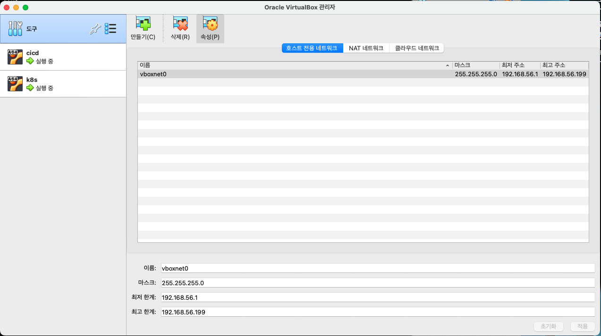

# 1. 환경 구축하기

## 개발 환경 구축하기

* https://cafe.naver.com/kubeops/227
* 자바 / 스프링부트 프로젝트

## 테스트 환경 구축하기

* https://cafe.naver.com/kubeops/228
* Layer : 읽기 모드로 공유해서 사용하므로 여러 곳에서 JDK를 사용한다고 해도 크기가 더이상 증가하지 않는다
* 도커 빌드할 때, Port(쿠버네티스에서는 Service), Env(ConfigMap), Mount(PV) 설정을 할 수 있다

### 맥에서 CI/CD +  운영 환경 구축하기&#x20;

* 맥 m4는.. ubuntu server arm64 24.04lts 만 된다
* virtualbox 도 맥silicon 버전 이다&#x20;

* virtualbox에서 네트워크 설정
  * 도구&#x20;
    * 호스트 전용 네트워크 생성 (192.168.56.1 \~ 192.168.56.199)
  * 각 VM 머신&#x20;
    * 어댑터1 : NAT
    * 어댑터2 : 호스트전용 네트워크 vboxnet0

<figure><figcaption></figcaption></figure>

* bridge network등록 됨을 볼 수 있다&#x20;
  * 이곳을 타고 host 와 연결한다&#x20;

<figure><figcaption></figcaption></figure>

| 네트워크 모드          | 외부 인터넷 | 호스트(Mac)와 통신 | 다른 VM과 통신 | 특징            |
| ---------------- | ------ | ------------ | --------- | ------------- |
| NAT              | ✅ 가능   | 🔸 포트포워딩 필요  | ❌ 불가      | VM이 내부망처럼 작동  |
| Host-Only        | ❌ 불가   | ✅ 직접 통신 가능   | ✅ 가능      | 외부로는 절대 안 나감  |
| Bridged Adapter  | ✅ 가능   | ✅ 가능         | ✅ 가능      | VM이 진짜 컴처럼 작동 |
| Internal Network | ❌      | ❌            | ✅ 가능      | VM끼리만 통신      |

#### jenkins 서버 구축 : 192.168.56.2

* ubuntu에 jenkins 설치하기 : [https://www.jenkins.io/doc/book/installing/linux/#debianubuntu](https://www.jenkins.io/doc/book/installing/linux/#debianubuntu)
  * 방화벽 설정 끄기&#x20;
  * java다운로드 -> jenkins다운로드 -> jenkins 실행
    * curl 요청은 되지만 브라우저에서 접속 불가능한 상황&#x20;
      * 원인 : 브라우저가 버츄얼박스의 호스트온리네트워크를 제대로 사용하지 못함 (브라우저 요청이 bridge100 인터페이스를 경유하지 못하고 있는 상태
      *   해결 : 포트포워딩 설정(NAT <-> Host Only)

          | 이름          | 프로토콜 | 호스트 IP    | 호스트 포트 | 게스트 IP       | 게스트 포트 |
          | ----------- | ---- | --------- | ------ | ------------ | ------ |
          | jenkins8080 | TCP  | 127.0.0.1 | 18080  | 192.168.56.2 | 8080   |

          ⇒ 크롬 127.0.0.1:18080  에서 접근 가능

#### 쿠버네티스 구축하기  192.168.56.3

* 우분투 24.04에서 쿠버네티스 설치하기 : [https://blog.injun.dev/posts/ubuntu-2404-kubernetes-single-node-cluster-setup/](https://blog.injun.dev/posts/ubuntu-2404-kubernetes-single-node-cluster-setup/)
  * 단계 요약&#x20;
    * 시스템 업데이트 및 필수 패키지 설치
    * 도커 설치&#x20;
    * 쿠버네티스 컴포넌트 설치
    * 시스템 설정
    * containerd설정
    * kubeadm 이미지 pull&#x20;
    * 쿠버네티스 클러스터 초기화&#x20;
    * 네트워크 플러그인 설치
    * 단일 노드 설정 완료 : taint

